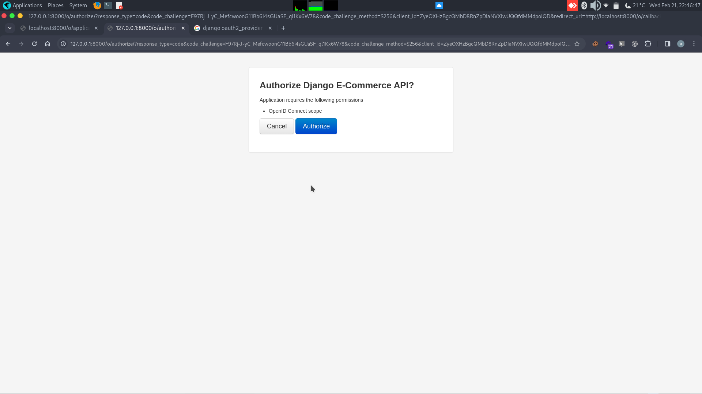
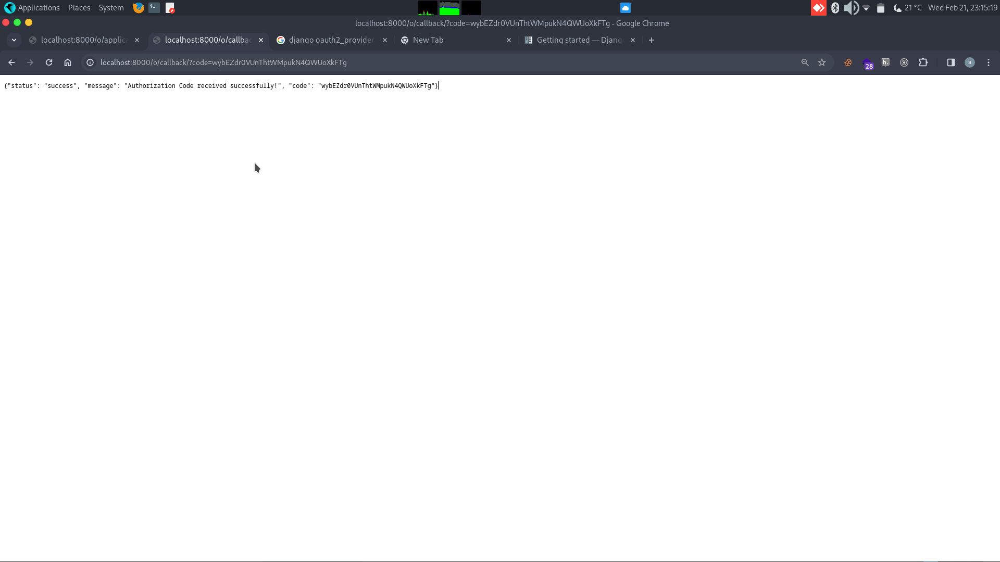

# 🚀 Django API - Customers && Orders 📦

Welcome to the Customer Order Management System API! This API allows you to manage customers, products, shopping carts, and orders efficiently.

## 🔧 Setup Instructions
1. Clone the repository:
    ```
    git clone https://github.com/Aduda-Shem/Django-API.git
    ```
2. Navigate to the project directory:
    ```
    cd Django-API
    ```

3. Create a `.env` file in the root directory with the content from `.env.example`.

4. Build and start the Docker containers:
    ```
    docker compose up --build
    ```

5. The server will start running at `http://localhost:8000`.
6. ## 🧪 Testing
The test files are located under the `tests` directory with different files:
- `test_models.py`
- `test_serializers.py`
- `test_views.py`
  
To run the tests
  ```
   python manage.py test
  ```

## 📋 API Endpoints
- .

## 💡 Additional Information
- Ensure Docker and Docker Compose are installed on your system.
- Authentication is required for endpoints that modify / retrieve data. Use Token Authentication to authenticate requests.

------------------------------------------
# 🔒 Authentication and Authorization

To set up authentication and authorization using OpenID Connect:

## Getting Started

Build an OAuth2 provider using Django, Django OAuth Toolkit, and OAuthLib.

## What's OAuth and Django?

OAuth is an open standard for access delegation, commonly used to grant websites or applications access to user information on other websites without requiring passwords.

Django is a high-level Python Web framework that encourages rapid development and clean, pragmatic design.

## Step-by-Step Guide

1. **Install Django OAuth Toolkit:**
    ```
    pip install django-oauth-toolkit
    ```

2. **Configure Django OAuth Toolkit:**
    Add `oauth2_provider` to `INSTALLED_APPS` and run migrations.

3. **Include OAuth URLs:**
    Include `oauth2_provider.urls` in `urls.py`.

4. **Set LOGIN_URL in settings.py:**
    Set `LOGIN_URL='/admin/login/'` in `iam/settings.py`.

5. **Create a SuperUser:**
    ```
    python manage.py createsuperuser
    ```

6. **Authorization Code Flow:**
    - Register an application.
    

    - Authorize the web app.
    

    - Obtain an access token.
    

