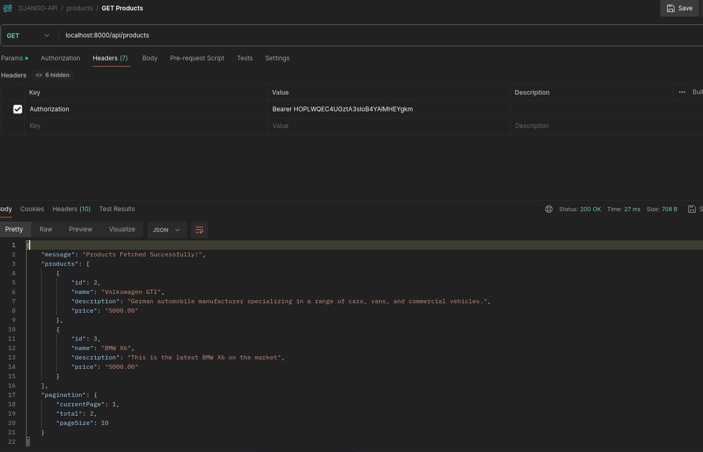
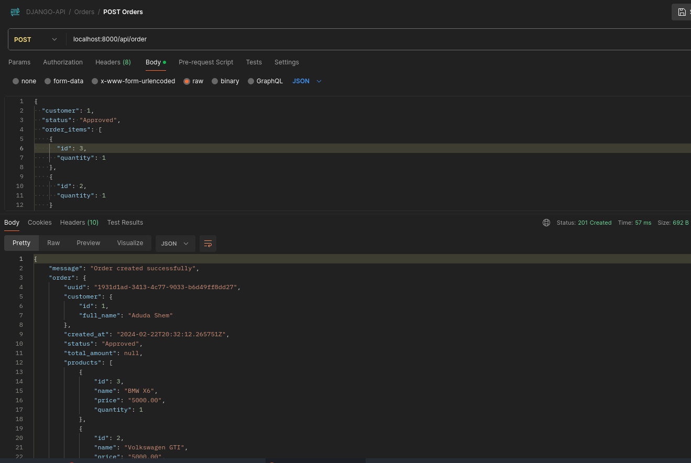

# Django API - E-Commerce

## Table of Contents
1. [Introduction](#introduction)
2. [Setup Instructions](#setup-instructions)
3. [Testing](#testing)
4. [Additional Information](#additional-information)
5. [Authentication and Authorization](#authentication-and-authorization)
6. [API Documentation](#api-documentation)
7. [Postman Collection](#postman-collection)

## Introduction
This is a Customer Order Management System API built with Django. It allows you to manage customers, products, and orders efficiently with authentication and authorization using OpenID Connect.

## Setup Instructions
1. Clone the repository:
    ```bash
    git clone https://github.com/Aduda-Shem/Django-API.git
    cd Django-API
    ```

2. Create a `.env` file in the root directory with the content from `.env.example`.

3. Build and start the Docker containers:
    ```bash
    docker-compose up --build
    ```

4. The server will start running at `http://localhost:8000`.

## Testing
To run the tests, Execute 
```bash
coverage run manage.py test
```
To view Coverage Report
```bash
coverage report
```
To generate coverage HTML Report
```bash
coverage html
```

## Additional Information
- Ensure Docker and Docker Compose are installed on your system.
- Authentication is required for endpoints that modify / retrieve data. Use Token Authentication to authenticate requests, To obtain TOkens follow the steps below:

------------------------------------------
## Authentication and Authorization

To set up authentication and authorization using OpenID Connect:

## Getting Started

Build an OAuth2 provider using Django, Django OAuth Toolkit, and OAuthLib.

OAuth is an open standard for access delegation, commonly used to grant websites or applications access to user information on other websites without requiring passwords.

## Step-by-Step Guide

1. **Install Django OAuth Toolkit:**
    ```
    pip install django-oauth-toolkit
    ```

2. **Configure Django OAuth Toolkit:**
    Add `oauth2_provider` to `INSTALLED_APPS` and run migrations.
    ```
    python manage.py migrate oauth2_provider
    ```

3. **Include OAuth URLs:**
    Include `oauth2_provider.urls` in `urls.py`.

    either:
    ```
        from django.urls import include, path

        urlpatterns = [
            ...
            path('o/', include('oauth2_provider.urls', namespace='oauth2_provider')),
        ]
    ```
    OR using re_path():
    ```
        from django.urls import include, re_path

        urlpatterns = [
            ...

            re_path(r'^o/', include('oauth2_provider.urls', namespace='oauth2_provider')),
        ]
    ```
 
4. **Set LOGIN_URL in settings.py:**
    Set `LOGIN_URL='/admin/login/'` in `settings.py`.

5. **Create a SuperUser:**
    ```
    python manage.py createsuperuser
    ```
    Login into the admin then browse to `http://127.0.0.1:8000/o/applications/register/` to register a new application

    Before saving, copy the `client id` and `client secret` , set the Redirect url : `http://127.0.0.1:8000/o/callback`
    

6. **Authorization Code Flow:**
    - Register an application.
        
    
    - generate an authentication code grant with PKCE (Proof Key for Code Exchange), useful to prevent authorization code injection.
    We do this by generating a `code_verifier` random string between 43 and 128 characters, encoded to produce a `code_challenge`, sample script:
    ```python
    import random
    import string
    import base64
    import hashlib

    code_verifier = ''.join(random.choice(string.ascii_uppercase + string.digits) for _ in range(random.randint(43, 128)))
    code_verifier = base64.urlsafe_b64encode(code_verifier.encode('utf-8'))
    print("code_verifier: ", code_verifier)

    code_challenge = hashlib.sha256(code_verifier).digest()
    code_challenge = base64.urlsafe_b64encode(code_challenge).decode('utf-8').replace('=', '')
    print("code_challenge: ", code_challenge)

    ```
    - After generating, start the Authorization code flow by using 
    ```
    http://127.0.0.1:8000/o/authorize/?response_type=code&code_challenge=[YOUR_CODE_CHALLENGE]=S256&client_id=[YOUR_CLIENT_ID]&redirect_uri=[YOUR_REDIRECT_URI]&scope=openid

    ```
    - Authorize the web app.

       

    - Obtain an access token.
    ```
        http://127.0.0.1:8000/o/authorize/?response_type=code&code_challenge=x00bLi98SBgwXewDAZ6OsVxVpTqaphvbTVG7vVrRNr4&code_challenge_method=S256&client_id=hUn9pxrpL0MinLPTyCcTv7zzbgCaXDrsAW84dweS&redirect_uri=http://localhost:8000/o/callbak&scope=openid

    ```
    - The above will redirect and generate a code
    `http://127.0.0.1:8000/o/callbak?code=[CODE]`

    

    - Now We will head over to Postman to generate the token we will use to authenticate our views
    

    - Bingo!!!!, Now we use the `access_token` as Authorization : Bearer `TOKEN`

## API Documentation
Each resource (customers, products, orders) is managed by a single API endpoint, which performs Create, Read, Update, and Delete (CRUD) operations based on the HTTP method and query parameters passed.
   - `http://localhost:8000/customers`
   - `http://localhost:8000/products`
   - `http://localhost:8000/products`

   `Product`
   - POST - Add Product
   
   - GET - Retrieve Products
   
   - PUT - Update a Product
   
   - DELETE - Delete a Product
   

   `Customers`
   - POST - Add a Customer
   
   - GET - Retrieve a Customer
   
   - PUT - Update a Customer
   
   - DELETE - Delete a Customer
   

   `Order`
   - GET - Retrieve Orders
   
   - POST - Add Order
   
   - DELETE - Delete an Order
   

## Postman Collection
[Download Postman Collection](postman/postman_collection.json)


# Django API Deployment with Docker Compose on AWS
This deployment setup includes:
- A PostgreSQL database container.
- Django API container.
- Nginx reverse proxy container for serving static files and forwarding requests to the Django API.
- Configuration files for Docker Compose, Django, Nginx, and uWSGI.

## Directory Structure

- **/proxy**: Contains configuration files for the Nginx reverse proxy server.
  - **default.conf.tpl**: Nginx configuration template defining how requests are handled.
  - **Dockerfile**: Dockerfile for building the Nginx proxy server image.
  - **run.sh**: Shell script for generating Nginx configuration and starting the server.
  - **uwsgi_params**: File containing mappings of HTTP headers to uWSGI variables.

## Deployment Steps
1. SSH into your EC2 instance and clone this repository.
2. Copy your `.env` file and Docker Compose files to the EC2 instance.
3. Run `docker-compose -f docker-compose.yml -f docker-compose-deploy.yml up -d` to deploy your Django API.


4. Access your Django API through the public IP or domain name of your EC2 instance.
